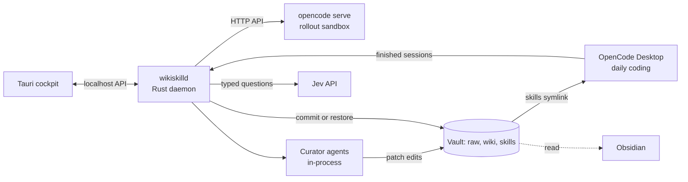
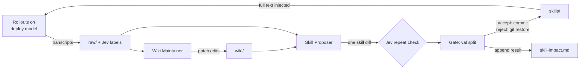

# WikiSkill Harness: Implementation Rationale

2026-09-19 · @Someone

**Revised 2026-09-20: OpenCode V2, and Mantle dropped.** The executor is now **OpenCode V2,
pinned to 2.0.x** (`opencode2`), and the Bedrock Mantle endpoint is gone. Two reasons, in order.
Mantle existed here only to reach models the runtime endpoint lacks, and nothing in the built
system asks for one — so it was a whole credential, a whole endpoint and a whole code path
carried for a hypothetical. Once it went, the case for staying on V1 went with it: V1 was pinned
because a migration is work, not because V1 did anything V2 does not. What V2 breaks is the
server API, the plugin API and the terminal client's config; V1 `.opencode/` definitions and
config files stay compatible. Sections below are rewritten in place; where a V1 fact was the
*reason* for a decision, the revision says so rather than quietly restating the conclusion.

## Decision

Build a macOS system in three parts: a Rust daemon, `wikiskilld`, that runs WikiSkill; a Tauri desktop cockpit that controls it; and **OpenCode**, pinned to the V2 line (2.0.x), as the executor for both rollouts and daily coding. OpenCode is the only harness that meets every must-have through configuration, and Rust fits the parts whose logic is ours.

Why OpenCode stays the executor:

- **Both providers work.** Amazon Bedrock and Fireworks AI are built-in. The deploy models are declared explicitly anyway, as a V2 `providers` entry using the native `@opencode/ai/providers/openai-compatible` package, so an id the bundled catalog has never heard of still gets the right capabilities and limits ([providers](https://opencode.ai/v2/docs/providers/)).
- **Its server has an HTTP API.** The daemon talks to it over `/api/…` with HTTP Basic auth, against the OpenAPI 3.1 spec the server itself serves at `/openapi.json`.
- **Skills are native.** OpenCode loads SKILL.md files from configured skill directories, so the vault's skills folder can be pointed at directly.
- **Evolve where you run.** OpenCode Desktop runs daily coding on the same config and skills, so what the loop evolves is what you use.

Why the rest is Rust and Tauri:

- **Our logic is Rust.** The loop, curator agents, vault, git, sandboxing and Jev calls live in the daemon. OpenCode moved its own desktop app off Tauri because its server is TypeScript, and Tauri pays off only when app logic is in Rust ([OpenCode on Electron](https://dev.to/brendonovich/moving-opencode-desktop-to-electron-4hip)).
- **The cockpit is a simple UI.** It shows runs, diffs and tables rather than long streaming transcripts, which is where OpenCode hit macOS WebKit rendering problems.

Three caveats shape the design. The server API is a moving target across major versions, so the daemon reaches it through an `Executor` trait — there is only one implementation behind it now, V1 having been deleted rather than kept, but the seam is what made a same-day migration possible. Bash commands can bypass OpenCode's path rules, so macOS Seatbelt profiles enforce isolation. And V2's permission model defaults an unmatched action to **ask**, which for a non-interactive client is a hung turn, so the rollout ruleset opens with allow-all and denies from there. The runner-up executor is pi.

## Requirements

Thirteen requirements fall out of the spec. Six come from the WikiSkill loop, one from the Obsidian vault, one from Jev, two from the inference providers (Bedrock, Fireworks), and three from running it as a Mac desktop app. Must-haves decide the harness; should-haves break ties.

| ID | Requirement | Where it comes from | Priority |
| --- | --- | --- | --- |
| R1 | Headless runs with a per-run system prompt, so the inference role gets full skill text injected | WikiSkill injects all active skills into the inference agent's prompt | Must |
| R2 | Per-role tool and file permissions: inference cannot see the wiki; maintainer writes only wiki/; proposer writes only one skill | Paper ablation: wiki access for the inference agent lowers final skill quality | Must |
| R3 | Transcripts in a parseable, per-session format | Raw layer stores full traces: reasoning, tool calls, outputs, answers | Must |
| R4 | Patch-style file edits (exact string replace) | Maintainer and proposer apply incremental, patch-based edits | Must |
| R5 | Programmatic API or server for an outer loop with parallel rollouts | Each iteration runs the train split, then the validation split | Must |
| R6 | Model chosen per role and swappable per run | Evolve with the deployed model; cross-model transfer experiments | Must |
| R7 | Skills loaded from an external directory (the vault) with SKILL.md format | Vault is source of truth; git restore on rejection | Should |
| R8 | Lifecycle hooks: session end (trace capture and Jev labels) and pre-prompt context injection (Jev skill router) | Jev integration points 1 and 4 | Should |
| R9 | Native Amazon Bedrock provider, including Claude and non-Claude models | Available inference | Must |
| R10 | An OpenAI-compatible custom provider, so a deploy model id can be declared rather than looked up in a bundled catalog | Available inference | Must |
| R11 | A desktop app on macOS to start, monitor and inspect runs | Operating the harness day to day | Must |
| R12 | Runs and schedules survive closing the app | An eight-iteration run takes hours | Must |
| R13 | OS-level isolation on a MacBook without Docker | Harness path rules can be bypassed by bash | Should |

## Harness evaluation

OpenCode clears all must-haves; pi clears most with more custom code; Claude Code fails on providers; DeepSeek Harness is too early.

| Harness | Providers (R9, R10) | Per-role permissions (R2) | Orchestration API (R5) | Hooks for Jev (R8) | Verdict |
| --- | --- | --- | --- | --- | --- |
| [OpenCode](https://opencode.ai/v2/docs/) | Bedrock and Fireworks built in; a native OpenAI-compatible provider package for declaring deploy models | Ordered rule array with path patterns, last match wins; bash can slip past `external_directory` | HTTP server with an OpenAPI spec, callable from Rust; many parallel sessions per server | `session.idle` and message events over a subscription; `session.hook("prompt")` and `("context")` run before the model request | **Pick** |
| [pi](https://github.com/badlogic/pi-mono/tree/main/packages/coding-agent) | Bedrock built in; Fireworks via custom provider config (verify) | None by design; build it as an extension | Print/JSON, RPC over stdin/stdout, and an SDK; one process per session | Extension events including `before_agent_start` and `session_shutdown` | Runner-up |
| Claude Code | Bedrock for Claude models; open models only through unsupported gateways | Rich allow/deny rules per settings file | `claude -p` headless mode and the Agent SDK | Richest set, including SessionEnd and prompt-time context injection | Rejected |
| [DeepSeek Harness](https://dev.to/justin3go/deepseek-harness-vs-claude-code-architecture-plugins-mcp-2nj7) | DeepSeek-first; plugin model adapters | Plugin-defined | Headless CLI mode | Plugin hooks; can reuse a Claude Code hooks.json | Rejected: developer preview |

**Why not Claude Code, given the best hooks?** WikiSkill found that skills evolved on one model can hurt another, so the loop must evolve and gate on the exact model you deploy. Locking to Claude models removes the Fireworks open models from that choice.

**Why pi stays the fallback.** Its minimal system prompt and `before_agent_start` hook give the cleanest full-skill injection and the best spot for a Jev router. It ships no permission layer, no sub-agents and no MCP by design, so role isolation would rest entirely on Seatbelt profiles ([README](https://github.com/badlogic/pi-mono/blob/main/packages/coding-agent/README.md)).

**Scope of this choice.** It picks the executor only. The orchestrator and both curator agents are native Rust in `wikiskilld`, so OpenCode's per-agent permissions now guard just the inference role.

## Provider and model plan

Rollouts and daily coding run DeepSeek V4 Pro on Fireworks, the model you will code with; V4 Flash takes cheap exploratory rollouts and small tasks. The maintainer and proposer stay on Claude models on Bedrock. Confirm exact model IDs in the Fireworks catalog and Bedrock console.

| Role | Model | Endpoint | Why |
| --- | --- | --- | --- |
| Inference (rollouts, gate, daily coding) | DeepSeek V4 Pro | Fireworks, built-in provider | Skills must be evolved and gated on the model that will run them |
| Exploratory inference (optional) | DeepSeek V4 Flash | Fireworks, built-in provider | Cheap, parallel early iterations at about a twelfth of Pro's token price; adopt only after re-gating on Pro |
| Wiki Maintainer | Claude Sonnet 5 | Bedrock runtime, called from the daemon | Long traces in, structured patch edits out; one session per iteration |
| Skill Proposer | Claude Opus 5 | Bedrock runtime, called from the daemon | One high-leverage change per iteration; cost is small |
| OpenCode `small_model` (titles, summaries) | DeepSeek V4 Flash | Fireworks, built-in provider | Keeps the default hosted small model out of your data path |
| Cross-family transfer tests | Open models on Fireworks, or Claude on the runtime endpoint | Existing endpoints | A transfer test needs a *different* family, not a particular vendor's gateway; nothing here needed a model only Mantle serves |
| Decision layer | Jev 1.13 | TypeSafe API | A fourth vendor; see the security section |

**Endpoint rule.** AWS recommends `bedrock-runtime` for most new applications, and only it offers cross-Region inference and Guardrails, so `bedrock-runtime` is the only Bedrock endpoint the daemon knows. `bedrock-mantle` would have bought Mantle-only models, background inference and Projects (per-role cost attribution); none of those turned out to be load-bearing, and the `Endpoint` enum is now `BedrockRuntime | Fireworks` ([AWS endpoints](https://docs.aws.amazon.com/bedrock/latest/userguide/endpoints.html)). Per-role cost attribution, if it becomes wanted, is cheaper to get from the daemon's own token accounting than from a second endpoint.

**Transfer evidence.** In the paper, a 27B model's skills lifted a 9B model's SpreadSheetBench score from 24.3% to 50.5%. But a 4B model's skills dropped Gemini-3.5-Flash from 50.5% to 18.1% on the same benchmark ([WikiSkill](https://arxiv.org/abs/2608.27454)). Skills evolved on V4 Flash are candidates for V4 Pro, never defaults.

**DeepSeek on Fireworks.** V4 Pro lists at $1.74 input and $3.48 output per million tokens, V4 Flash at $0.14 and $0.28, and both take a 1M-token context ([Pro](https://www.requesty.ai/models/fireworks/deepseek-v4-pro), [Flash](https://www.requesty.ai/models/fireworks/deepseek-v4-flash)). DeepSeek's own API has already retired V4 Flash and serves those requests with V4.1-Flash ([DeepSeek pricing](https://api-docs.deepseek.com/quick_start/pricing)). If Fireworks ever changes the model behind an ID, treat it as a new executor: re-run the empty-skill baseline and re-gate.

Deploy-model wiring in the rollout server's private `opencode.json`, which the daemon generates
per run. This is the V2 shape — `providers`, not V1's `provider`; a `package`, not an `npm`; and
`permissions` as an ordered array, not a `permission` object:

```json
{
  "update": "disable",
  "snapshots": false,
  "mcp": { "servers": {} },
  "model": "wikiskill-deploy/<deepseek-v4-pro-id>",
  "providers": {
    "wikiskill-deploy": {
      "name": "WikiSkill deploy models",
      "package": "@opencode/ai/providers/openai-compatible",
      "env": ["FIREWORKS_API_KEY"],
      "settings": { "baseURL": "https://api.fireworks.ai/inference/v1" },
      "models": {
        "<deepseek-v4-pro-id>": {
          "name": "<deepseek-v4-pro-id>",
          "capabilities": { "tools": true, "input": ["text"], "output": ["text"] }
        }
      }
    }
  },
  "permissions": [
    { "action": "*", "resource": "*", "effect": "allow" },
    { "action": "external_directory", "resource": "*", "effect": "deny" },
    { "action": "skill", "resource": "*", "effect": "deny" }
  ]
}
```

Four things in there are deliberate, and each was learned by getting it wrong first:

- **The key is declared by name**, `"env": ["FIREWORKS_API_KEY"]`, not as a value and not as a `{env:…}` template. The rollout can read this file.
- **`capabilities` is explicit.** An uncatalogued id otherwise inherits V2's fallback limits, which are a guess about someone else's model.
- **`permissions` opens with allow-all and denies from there.** V2 treats an unmatched action as `ask`; enumerating the allowed actions would hang the first turn that used an action V2 or a plugin added later. Denies are what the array is *for*.
- **The native package, not the AI-SDK one.** `@opencode/ai/providers/openai-compatible` needs no `aisdk:` prefix and no npm fetch at run time, which matters inside a sandbox with no write access to a global cache.

The same array is also sent on each `POST /api/session`, because the config binds the server's own title and compaction agents while the session copy is what binds the rollout.

**Two client paths.** The OpenCode config above serves rollouts and daily coding. The daemon's curator agents call models directly: Bedrock through the AWS SDK for Rust's Converse API, Fireworks through an OpenAI-compatible client with a custom base URL. Keys live in the macOS Keychain and are read only by the daemon. On Bedrock use the **inference-profile** id (`global.anthropic.claude-sonnet-5`); the bare model id is rejected as unknown, and the newer Claude models reject `temperature` outright rather than ignoring it.

## Architecture

A Rust daemon owns every run and schedule; the Tauri app is a thin client; OpenCode executes rollouts and daily coding. Runs take hours, so they must not live in the GUI process.



The daemon is the only process that writes to the vault; Obsidian and the cockpit read it.

One iteration inside the daemon:



Only `skills/` feeds back into rollouts, and the wiki is never rolled back.

**Components**

- **`wikiskill-core`**, a library crate: loop, gate, verifier runner, curator agents, model clients, Jev client, vault and git.
- **`wikiskilld`**, a launchd agent: owns runs and schedules, supervises `opencode serve` under the rollout Seatbelt profile, and serves a localhost API with a bearer token. Run state lives in `~/Library/Application Support/wikiskill/`.
- **Tauri cockpit**: see the next section.
- **OpenCode Desktop**: daily coding with the same config; its skills folder is a symlink into the vault, and a small plugin reports finished sessions.
- **Vault**: an Obsidian folder that is also a git repo, kept outside Documents, Desktop and iCloud Drive.

**Vault layout**

```
~/Vaults/Agents/WikiSkill/
  raw/iter-NNN/<task>.md      condensed trace + Jev frontmatter
  raw/_jsonl/                 full transcripts (redacted)
  wiki/index.md               static catalog, maintainer-owned
  wiki/logs.md                append-only, maintainer-owned
  wiki/skill-impact.md        append-only, daemon-owned
  wiki/patterns/*.md          one pattern per note
  skills/<name>/SKILL.md      what the agent executes
  skills/<name>/PURPOSE.md    [[links]] to motivating patterns
  eval/train.jsonl, eval/val.jsonl, eval/test.jsonl
```

Rejection runs `git restore skills/` only, which matches the paper's rule that skill changes roll back while the wiki persists.

## Desktop app

The Tauri app is a cockpit for running and inspecting WikiSkill; coding sessions stay in OpenCode Desktop. OpenCode moved its own desktop app from Tauri to Electron for two reasons: macOS WebKit rendered its chat UI slower than Chromium, and launching a bundled CLI hurt startup and sometimes failed ([OpenCode on Electron](https://dev.to/brendonovich/moving-opencode-desktop-to-electron-4hip)). A cockpit of tables, diffs and markdown sidesteps the first; the daemon, not the app, supervises OpenCode, which sidesteps the second.

| View | Shows | Actions |
| --- | --- | --- |
| Runs | Iterations, train and validation scores, token cost per role | Start, pause, resume |
| Gate | Each proposal's diff, validation score, Jev repeat check | Re-run validation |
| Skills | Active skills and their PURPOSE links | Open in Obsidian; revert to an earlier accepted version |
| Patterns | Wiki patterns and occurrence counts | Open in Obsidian; approve Jev merge proposals |
| Labels | Low-confidence Jev labels | Mark pass or fail |
| Schedule | Nightly maintainer, weekly proposer | Enable, disable, run now |

"Open in Obsidian" uses `obsidian://open` links, so Obsidian stays the place to read and annotate memory.

**Boundaries.** The Tauri backend only relays calls to the daemon's localhost API. API keys never reach the webview; TypeSafe's own SDK blocks browser use for the same reason ([Jev deep dive](https://flaviocopes.com/jev/)).

**Daily-use capture.** OpenCode Desktop now runs its server inside Electron's Node process, so plugins that depend on Bun-specific APIs fail there ([OpenCode on Electron](https://dev.to/brendonovich/moving-opencode-desktop-to-electron-4hip)). The capture plugin uses only its plugin context and `fetch`: it subscribes to the event stream, and on `session.idle` reads the session's messages and posts them to the daemon. In V2 that subscription is an async iterator the plugin owns, so the plugin also owns stopping it — the cleanup function returned by `setup` aborts it, without which a reload would leave the old subscription filing every session twice.

**Candidate crates** (to confirm, not decisions)

| Concern | Crate |
| --- | --- |
| Desktop shell | `tauri` 2 |
| Async runtime and localhost API | `tokio`, `axum` |
| Bedrock | `aws-sdk-bedrockruntime`, Converse API |
| Fireworks | `async-openai` with a custom base URL |
| OpenCode client | hand-written `reqwest` against the pinned spec, not generated: the daemon calls six routes, and a generated client for the whole surface was more code to migrate than the six |
| Jev | `reqwest` and `serde` against `POST /v1/systemone` |
| Git | `gix` or `git2` |
| Keychain | `keyring` |

**Distribution.** Sign with a stable identity so macOS privacy grants survive rebuilds. Skip the Mac App Store, whose sandbox would stop the daemon spawning `sandbox-exec` and agent processes. The app registers the daemon as a launchd agent on first launch.

## Role configuration

Only the inference role runs inside OpenCode. The maintainer and proposer are native Rust agent loops in the daemon, and the gate is daemon code.

| Role | Runs as | Tools | Enforcement | Prompt source |
| --- | --- | --- | --- | --- |
| Inference | OpenCode agent `wiki-inference` on the daemon's `opencode serve` | OpenCode defaults, less `skill`, `question`, `webfetch`, `websearch` and `external_directory` | Rollout Seatbelt profile, then OpenCode permissions | Regenerated each iteration: every active SKILL.md concatenated |
| Wiki Maintainer | Rust agent loop in `wikiskilld` | read, list, str\_replace, create; no shell or web | Tools resolve real paths and write only under `wiki/` | Fixed role prompt; sampled trace paths in the first message |
| Skill Proposer | Rust agent loop in `wikiskilld` | Same four tools | Writes only under `skills/`; the diff must touch one skill folder | Fixed role prompt; wiki index, impact log and outcome table |
| Gate | Daemon code | None | n/a | n/a |

**Why the curators went native.** They need four file tools and no shell, so their path rules become code instead of config, and bash can no longer route around them. The loop is small: send tool schemas, run the requested tools, append results, and stop on a final answer or a turn cap.

The inference agent's native `skill` tool stays denied during evolution, so skills arrive only through full injection, as in the paper. If a proposal's `git diff` touches more than one `skills/<name>/` folder, the daemon rejects it before any validation run.

Inference agent file in the rollout config, `agents/wiki-inference.md`:

```markdown
---
description: WikiSkill rollouts with injected skills
mode: primary
model: fireworks-ai/<deepseek-v4-pro-id>
permission:
  skill: deny
  external_directory: deny
  webfetch: deny
---
<generated each iteration: every active SKILL.md, concatenated>
```

**One iteration in the daemon**

1. Regenerate `wiki-inference.md` from `skills/`, then restart the rollout server so it loads.
2. For each train task, create a session, prompt it with the agent and deploy model, and fetch its messages over the HTTP API.
3. Score each transcript with the verifier, redact it, label it with Jev, and write the raw note.
4. Run the maintainer loop, then the proposer loop, in-process.
5. Check the diff scope and run the Jev repeat check.
6. Run the validation split, gate, append to `skill-impact.md`, commit or restore, and push status to the cockpit.

The injected skill block is identical across every rollout in an iteration, so Fireworks prompt caching, which V4 Pro supports, should absorb much of its cost.

## Jev integration

Jev makes the cheap, typed judgments between LLM roles; it never gates, writes, or counts. Every call comes from the daemon over plain HTTPS: TypeSafe ships JavaScript and Python SDKs but no Rust one, and the whole API is one endpoint, `POST /v1/systemone`.

| Integration | Runs in | Jev questions | What code does with the answers | Phase |
| --- | --- | --- | --- | --- |
| Trace labeling | Daemon after each rollout, and for sessions posted by the OpenCode Desktop plugin | Noul: task completed? Choice: failure type, with `other`. Score: severity | Writes raw-note frontmatter; drives stratified sampling; low-confidence traces go to the cockpit's Labels view | 3 |
| Pattern dedup | Daemon, before the maintainer | Choice over existing pattern names plus `new_pattern` | Increments `occurrences`, appends evidence links; only new clusters reach the maintainer as new | 3 |
| Repeat-proposal check | Daemon, between proposer and gate | One Noul per rejected entry in `skill-impact.md` | High probability sends one warning back to the proposer; never a hard block | 3 |
| Skill routing | Daily use only | Noul per skill, then a second pass on the top few | Would inject chosen skills; see below | 4 |

**Limits that shape the calls.** State plus the longest question must fit in about 32,000 tokens, and a Choice allows up to 255 options. Jev is unreliable at counting and dates, so occurrence counts stay in code ([deep dive](https://flaviocopes.com/jev/)). Traces are condensed first: failed tool calls, the final turns, and chunks a per-chunk Noul marks relevant.

**Why routing waits — and what changed.** The original reason was that V1 documented no hook running before the first model call of a turn, so a router could only inject skills after the model had started. **V2 removes that blocker**: `ctx.session.hook("prompt")` runs before durable prompt admission and `ctx.session.hook("context")` runs immediately before an agent model request, with `event.system` and `event.messages` both mutable. So routing is now a phase-4 *choice* rather than a phase-4 impossibility. It still waits, for the reason that was always the better one: there is no evidence yet that retrieval beats injecting every skill, and the paper names retrieval as untested. Measure the trigger rate first — native lazy skill loading handles daily use, and a Jev Noul per session says whether a relevant skill was loaded. If that rate is poor, the hook is there.

**Rollout discipline.** Run every Jev call in shadow mode first, logging answers without acting. Hand-label 30 to 50 traces and check that confidence tracks accuracy before setting thresholds. Pin `jev-1.13.0` and record it in each note's `labeled_by` field.

## Isolation, security and data handling

macOS Seatbelt profiles and in-code tool checks are the security boundary; OpenCode permission rules are a second layer. Codex CLI uses the same mechanism, running commands under `/usr/bin/sandbox-exec` with a generated policy that covers the whole process tree ([Codex discussion](https://github.com/openai/codex/discussions/1174)). OpenCode's own path rules can be bypassed by bash redirection ([#40159](https://github.com/anomalyco/opencode/issues/40159), [#42979](https://github.com/anomalyco/opencode/issues/42979)).

| Threat | Control |
| --- | --- |
| Inference agent reads the wiki, which the paper shows degrades skills | Rollout Seatbelt profile denies reads of the vault path; the rollout server runs with its own `HOME` and `XDG_CONFIG_HOME`, so it never loads the daily skills symlink or MCP servers |
| Maintainer or proposer rewrites history in `raw/` | Rust tools refuse writes outside `wiki/` or `skills/`; raw files are also set read-only |
| The profile breaks a task toolchain | Codex's profile blocks most IOKit access, which broke Metal for GPU subprocesses ([#17644](https://github.com/openai/codex/issues/17644)); run the full task set under the profile in phase 0 |
| Apple retires `sandbox-exec`, which it already marks deprecated | Keep profile generation behind a trait; fall back to a Linux VM for rollouts |
| Secrets in transcripts reach the vault, a git remote, or Jev | Redaction pass (pattern rules plus entropy check) before any write or Jev call |
| API keys leak through the app | Keys live in the Keychain and are read only by the daemon, never the webview |
| Jev retains trace data | Direct TypeSafe API offers zero data retention to enterprise customers only; otherwise send condensed, redacted state |
| OpenCode sends data to its own hosted services | Pin `small_model` to V4 Flash on your Fireworks account and set `"share": "disabled"` in both rollout and daily configs |
| Injected instructions in tool output flow into patterns and skills | Curator agents have no shell or web; every skill change must pass the gate; optional Jev Noul flags injection-like chunks |
| macOS privacy prompts block the daemon | Vault outside Documents, Desktop and iCloud Drive; stable signing identity |
| Over-broad cloud access | A Fireworks key for rollouts and daily coding; an AWS profile scoped to the curator models |
| Two sync systems fight over the vault | Pick git or Obsidian Sync, not both |
| Fireworks sees every rollout and daily session in full | Check Fireworks' data-retention terms for your account before pointing it at real repositories; redaction protects the vault and Jev, not inference |

All Bedrock traffic is on `bedrock-runtime`, so a Guardrails policy has nowhere else to need to be — this used to be a caveat about Mantle, which does not support Guardrails ([AWS endpoints](https://docs.aws.amazon.com/bedrock/latest/userguide/endpoints.html)).

Two controls the V2 move added:

| Threat | Control |
| --- | --- |
| Another local process reads the executor's server password out of `ps`, and then drives the rollout server | V2 requires HTTP Basic auth. The daemon generates the password per supervisor and passes it in the child's **environment**, never in `argv` and never into the config file the rollout can read. A server left behind by an earlier run also cannot answer for this daemon |
| A rollout reads the user's real home, which the sandbox must partly open for the executor to start | Only directory **nodes** are granted, with `(literal …)` rather than `(subpath …)`: `/Users`, the home, `~/.claude`, `~/Library`, `~/Library/Application Support`. V2 probes two of those regardless of the `HOME` it is handed, and a denied *parent* turns a harmless ENOENT into an EPERM — which surfaces as a bare `500` from the prompt endpoint with no log line anywhere. A listing leaks names, not content, and the vault deny is still last |

## Evaluation and gating

The gate follows the paper exactly: a skill change is kept only if the validation score strictly beats the best so far, scored by a deterministic verifier on the deploy model.

**Task set.** Start with 60 tasks from your own work that a script can check: failing tests to fix, commands with known output, refactors guarded by a test suite. Split them 30 train, 15 validation, 15 test, with no overlap. These sizes are my starting point, not the paper's.

**Verifier.** Runs under the rollout Seatbelt profile after each session and returns a score from 0 to 1, such as the fraction of target tests passing. No LLM or Jev judgment enters the score.

**Acceptance rule (from the paper)**

- The best score starts at the empty-skill validation score.
- Accept only if the new validation score is strictly higher; otherwise `git restore skills/`.
- Stop early if validation reaches 100%.
- Append to `skill-impact.md` on every outcome; never roll back the wiki.

**Noise.** With 15 validation tasks, one task moves the score by 6.7 points, and the paper itself notes the strict rule discards neutral changes. An optional deviation: run validation twice and gate on the mean. Record which rule you used in each impact entry.

**Budget.** The paper's accepted updates spread across iterations 0 to 7, so plan for 8 iterations. At 30 train plus 15 validation rollouts each, that is 360 rollouts, plus 15 for the baseline and 15 for the final test.

Impact entry, written by the daemon:

```markdown
### iter-004 · break-repetition-loop · Rejected
- val: 0.600 (best 0.667) · rule: strict, single run
- jev_repeat_of: iter-001 (p=0.82, warned)
- diff: (unified diff of skills/break-repetition-loop/)
```

## Risks and rollout

Build in five phases, so the paper-faithful loop works from the command line before the cockpit, Jev or daily use add variables.

| Phase | Scope | Exit criterion |
| --- | --- | --- |
| 0. Foundations | Vault and git outside iCloud; `wikiskill-core` with Bedrock and Fireworks clients; OpenCode 2.0.x pinned; rollout Seatbelt profile; verifier; 60-task set | Empty-skill validation and test scores on the deploy model; every task's reference solution passes under the profile |
| 1. Faithful loop | `wikiskilld` with curator agents, driven from a CLI; eight iterations; no Jev | Test score compared with the empty-skill baseline; wiki readable in Obsidian |
| 2. Cockpit | Tauri app with Runs, Gate, Skills and Patterns views over the daemon API | A full run started, watched and inspected from the app, surviving an app restart |
| 3. Jev | Labeling, dedup and repeat check, shadow mode first; Labels view | Jev labels match hand labels at your chosen threshold |
| 4. Daily use | OpenCode Desktop capture plugin, nightly maintainer, weekly proposer, Schedule view | Skill trigger rate measured; router go or no-go |

| Risk | Mitigation |
| --- | --- |
| A future major version revises the server API again, as V2 did ([migration guide](https://opencode.ai/v2/docs/migrate-v1/)) | Pin the minor and check the version at startup; keep every call behind the `Executor` trait. Done once already: the V1→V2 move touched one client file, one supervisor and one plugin, and the pin is what stopped a stray `opencode` on `PATH` being picked up mid-migration |
| The pinned version check passes but a plugin silently never loads, because V2 renamed its directories | The daemon writes agents to `agents/` and the install instructions say `plugins/` — both plural. A file in V1's `agent/` or `plugin/` is not an error; it is an agent or plugin that does not exist, surfacing much later as a session failure naming something the loop just wrote |
| OpenCode Desktop and the rollout server drift apart | Pin both to the same release and share one provider config; only `HOME` and skills differ |
| OpenCode Desktop's Node runtime rejects Bun-only plugin code | Capture plugin uses only its plugin context and `fetch` |
| Seatbelt blocks a toolchain, or Apple retires it | Phase 0 test under the profile; Linux VM fallback behind a trait |
| Skills fail to trigger in daily use; the paper injected all skills and names retrieval as untested | Measure trigger rate in phase 4 before adding a router |
| Skills evolved on V4 Flash hurt V4 Pro | Re-gate on V4 Pro before adoption |
| Jev access is early-stage and adds a vendor | Phases 0 to 2 run without Jev; Vercel's AI Gateway is a second access route |
| Wiki grows without bound; the paper has no pruning | Monthly Jev pair-check to propose pattern merges, approved in the cockpit |
| Validation set overfits | Touch the test split once per run; refresh tasks between runs |
| The cockpit creeps into a chat client | Chat stays in OpenCode Desktop; revisit Electron only if one-app chat becomes a must-have |
| Fireworks changes the model behind an ID, as DeepSeek's own API did for V4 Flash | Record the model ID in every impact entry; re-baseline and re-gate on any change |

**Open questions**

- Should the maintainer and proposer move to DeepSeek V4 Pro as well, or stay on Claude?
- Which work supplies the 60 checkable tasks?
- Git or Obsidian Sync for the vault?
- Direct TypeSafe access, or Jev through Vercel's AI Gateway?
- Is OpenCode Desktop acceptable for daily coding, or must chat live inside the cockpit? The second pushes the shell toward Electron.

## Sources

- [WikiSkill paper, arXiv 2608.27454](https://arxiv.org/abs/2608.27454)
- OpenCode V2 docs: [config](https://opencode.ai/v2/docs/config/), [providers](https://opencode.ai/v2/docs/providers/), [permissions](https://opencode.ai/v2/docs/permissions/), [agents](https://opencode.ai/v2/docs/agents/), [plugins](https://opencode.ai/v2/build/plugins/), [migrate from V1](https://opencode.ai/v2/docs/migrate-v1/), [migrate plugins from V1](https://opencode.ai/v2/build/plugins/migrate-v1/), and the index at [llms.txt](https://opencode.ai/v2/llms.txt)
- Note on the V2 docs: the schema at `https://opencode.ai/config.json` may describe V1, and must not be used to infer V2 field names or shapes. The running server's own `/openapi.json` is the authority for the API.
- OpenCode issues [#40159](https://github.com/anomalyco/opencode/issues/40159) and [#42979](https://github.com/anomalyco/opencode/issues/42979)
- [Moving OpenCode Desktop to Electron](https://dev.to/brendonovich/moving-opencode-desktop-to-electron-4hip)
- Codex sandboxing: [Seatbelt discussion](https://github.com/openai/codex/discussions/1174), [IOKit issue #17644](https://github.com/openai/codex/issues/17644)
- [Amazon Bedrock endpoints](https://docs.aws.amazon.com/bedrock/latest/userguide/endpoints.html)
- pi: [README](https://github.com/badlogic/pi-mono/blob/main/packages/coding-agent/README.md), [providers](https://github.com/badlogic/pi-mono/blob/main/packages/coding-agent/docs/providers.md)
- [DeepSeek Harness vs Claude Code](https://dev.to/justin3go/deepseek-harness-vs-claude-code-architecture-plugins-mcp-2nj7)
- Jev: [deep dive](https://flaviocopes.com/jev/), [OpenRouter listing](https://openrouter.ai/typesafe/jev-1.13)
